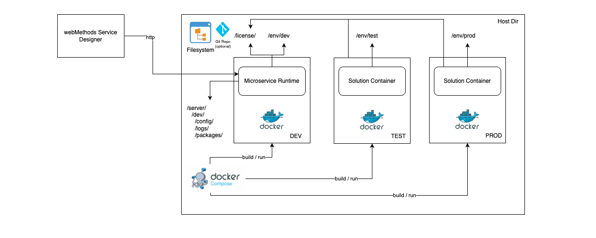
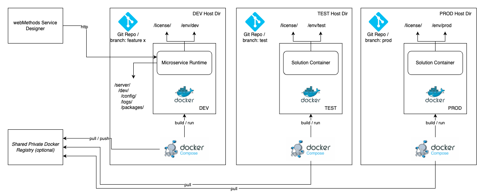
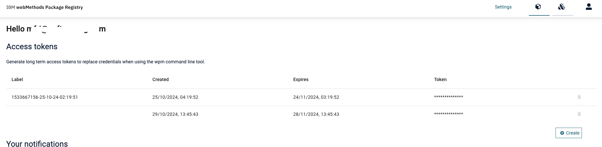
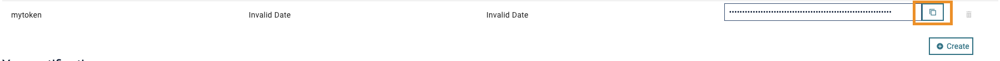
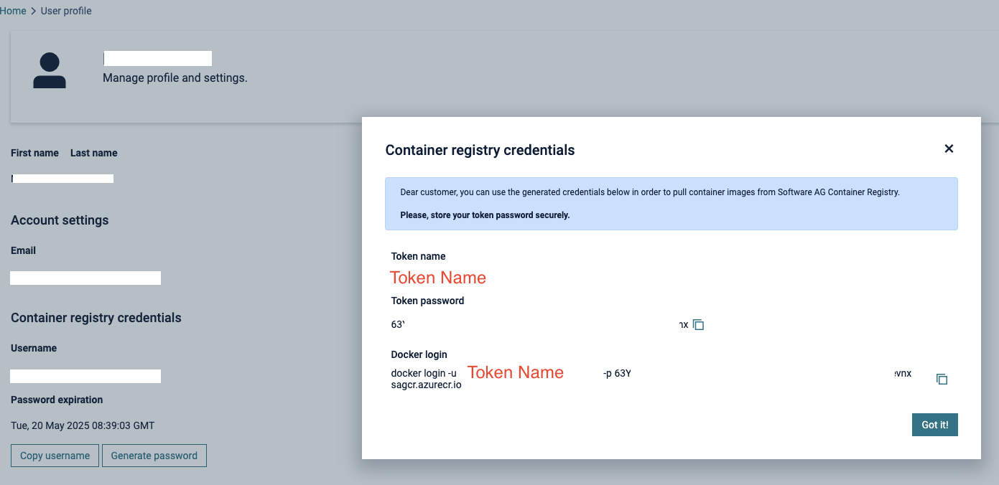

# webMethods Container in a Nutshell

This project provides a straightforward setup for containerizing webMethods Microservices Runtimes using only Docker and Docker Compose. It is primarily designed for learning and testing purposes, enabling users to explore webMethods in containerized environments. Additionally, it supports smaller installations that don’t yet require the complexity of an enterprise-level Kubernetes deployment.

## Scenarios

This project can be used to setup a development, test and production dockerized webMethods Microservice Runtime environment using docker and docker compose. 

### Single Host / Single Dev Stream

In this scenario all environments (dev, test, prod) are hosted on the same host and directory. All changes are done directly on the filesystem and can be deployed by simply running the wm.sh start <environment> script. This will automatically build the image for the target environment and fetch any runtime properties from the corresponding env directory. Optionally, changes can be committed to Git in order to detect changes and beeing able to rollback changes in case it is needed.

This setup should only be chosen for a simple jump start and not for long-term production-grade scenarios.




### Multi Host (and/or Directory) / Branches for Environments

In this scenario the project is cloned into separate Hosts and / or directories, where each environment will point to a dedicated branch of the repository reflecting the last state of configuration and code changes for the target environment (e.g. dev, test, prod). This way all environments are isolated against accidental changes and allow also easy rollbacks.

Optionally a shared private docker registry can be used to avoid building images on each target environment separately and simply prepare a build of a solution image upfront.

This setup should be chosen for production-grade scenarios.




## Directories

```plain
.
├── Dockerfile                              Multistage Dockerfile (for all environments)
├── README.md                               This File
├── compose.yaml                            Docker compose file
├── env                                     Environment folder for runtime parameters of environments
│   ├── dev
│   ├── prod
│   └── test
├── images                                  Image files for README.md
├── libs                                    Library folder for 3rd party libraries (e.g. required for JDBC, SAP Adapter, etc)
│   └── IntegrationServer                   
├── license                                 License Folder, place the licenseKey.xml for MicroservicesRuntime here
│   └── licenseKey.xml
├── server                                  Main folder for packages, configs and logs of the dev container (externalized)
│   └── dev                                 
├── wm.sh                                   main script for install, setup, run, etc.
└── wpm                                     wpm install folder (either manually downloaded or using the setup.sh script)
```

## Prerequisites

### Access Token for packages.webmethods.io

To fetch official packages (e.g. Adapters) from IBM webMethods, open https://packages.webmethods.io and login with your Empower credentials.



Create a new token by clicking on Create

Enter a name for the token and a validity (days).

In the Access Tokens screen you should now see the new token. Click on the copy to clipboard icon - copy the token to a file for later reference. Note: the Access Token might show initially invalid Date - simply ignore this, it will refresh with the correct date after you refreshed the window.




### Access Token for containers.webmethods.io

You will need also the microservices runtime base image from IBM webMethods from https://containers.webmethods.io. Login with your Empower credentials and create a new access token by clicking Settings and Generate Password. Copy the token name and password for later reference.




### License Key for Microservices Runtime

The Microservices Runtime requires a valid license key to unlock all features. By default, the base image from webMethods Containers registry (https://containers.webmethods.io) includes only a limited license, with restrictions on time and features. To apply a full license, place a licenseKey.xml file in the /license directory of the project. Running the start.sh command will activate the Docker Compose service, which automatically mounts the /license directory into the container.

## Installation 

Download or fork this project as a template project. Call install.sh and provide a target folder for your project. 

```bash
./wm.sh install <target folder>
```

This will simply copy this project into the target folder. 

## Setup

Run wm.sh setup to setup your current environment on the current host. The script will initially check if your environment was setup correctly and ask for access tokens for https://packages.webmethods.io and https://containers.webmethods.io.

```bash
./wm.sh setup
```

## Start

To start a Microservices Runtime in a container use the start.sh ```<environment>``` to start the container. The script will automatically fetch any runtime configuration for the target ```<environment>``` from the /env/```<environment>``` folder and apply it to the container.

```bash
wm.sh start dev
```
This will build a base image for dev if the base image is not present in the local docker registry and start the Microservices Runtime container on the local host.

## Stop

To stop a running instance use the wm.sh stop ```<environment>``` to stop the container.

## Logs

To view logs for a specific environment (container), use the wm.sh logs ```<environment>``` which will output the logs from the corresponding container.

## Build

If you prefer to build images before depoying changes to an upper environment, simply call wm.sh build -i ```<image-name>``` -t ```<image-tag>```

```bash
wm.sh build -i solution-image -t 10.15.0.7-20241031
```

Builds a new image with the name solution-image:10.15.0.7-20241031.

## Deployment

By default, when you run:

```bash
wm.sh start <environment>
```

Docker compose will start building an image if it is not presen and use the image and image tag as present in the ```env/<environment>/image``` file:

```properties
IMAGE=msr-solution
TAG=latest
```

Change this if required to the desired image and image tag as defined in the build step above. 

# References

1. webMethods Microservices Runtime in Container

https://docs.webmethods.io/on-premises/webmethods-integration-server/11.1.0/webhelp/index.html#page/pie-webhelp/to-docker.html

2. Configuration Variables (application.properties)

https://docs.webmethods.io/on-premises/webmethods-integration-server/11.1.0/webhelp/index.html#page/pie-webhelp%2Fto-configuration_variables_for_docker.html%23


3. Environment Variables Defined in Integration Server and Microservices Runtime

https://docs.webmethods.io/on-premises/webmethods-integration-server/11.1.0/webhelp/index.html#page/pie-webhelp%2Fto-sag_environment_variables_2.html